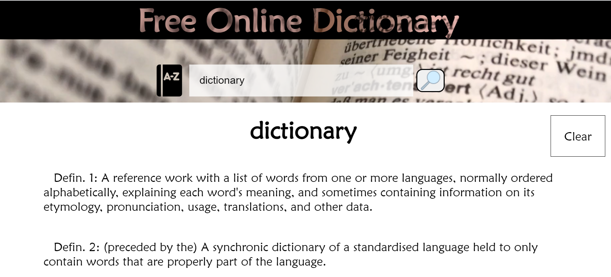

# Online Free English Dictionary

Sitio web con el objetivo de obtener el resultado de significados en el idioma inglés.

## Objetivo

Practica de Javascript API con fetch nativo, metodo GET, y utilizando JS para cambiar el DOM y manipularlo. 
El resultado es las definiciones para una palabra, y su fonética.

## Herramientas y Lenguajes

### Lenguajes 
  #### HTML5, CSS, Javascript ES5 y ECMAscript 6
### Herramientas
  #### Visual Studio Code, API Free Dictionary - https://dictionaryapi.dev/
